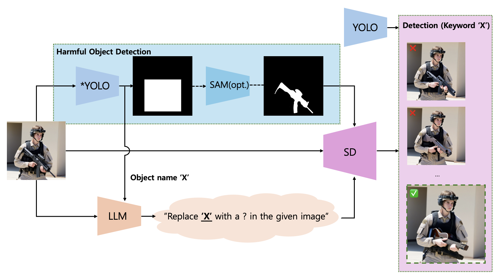

## From R-Rated to G-Rated : Towards Automated Harmful Object Replacing System


## Overview

**R2G** is an automated harmful object replacing system where the generated alternatives are validated via real-time object detector for the satisfactory results, which has not been considered in previous research.



My detailed overview including model name specification is coming soon.


## Note

Please check out my [RFP file](https://drive.google.com/file/d/1p30rXkSUDxruXhMjLw4FrBJkIdyrPAW4/view?usp=sharing) for this project. My RFP was proposed on 22th, March, 2024 during Artificial Intelligence course at Hanyang University. 

This project is built based on the RFP but contains many modifications in puersuit of the automated system.


## News

After this work done, **R2G++** will be release which is performed in video domain with temporal consistency while R2G is for the single-frame swapping.

## Dataset

[Harmful Object Detection(HOD)](https://github.com/poori-nuna/HOD-Benchmark-Dataset?tab=readme-ov-file) dataset is needed.


## 📅️ Roadmap

| Status | Milestone                                                                                             |    ETA     |
| :----: | :---------------------------------------------------------------------------------------------------- | :--------: |
| ✅ | **Overview README update for the project** | 2024-07-14 |
| 🚀 | **Release the inference code**              | 2024-08-01 |
| 🚀 | **Release the train code**              | TBD |


## License

Copyright (C) 2024 Junyeong Ahn, all rights reserved. Please contact me if you are interested in making use of this project or making any modifications upon it.

## Citation


```
@misc{Justin2024r2g,
  author={Junyeong Ahn},
  title={{From R-Rated to G-Rated : Towards Automated Harmful Object Replacing System}},
  month={July},
  year={2024},
  note={Version 0.1.0},
  howpublished={\url{https://github.com/justin4ai/R2G}},
}
```